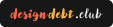

# Google Keep Import Plugin

In case it's not glaringly obvious: This is a fork from [daledesilva/obsidian_google-keep-import](https://github.com/daledesilva/obsidian_google-keep-import)

Google Keep Import is a plugin for [Obsidian](https://obsidian.md) that enables easily importing an exported set of backup notes and related attachments from Google Keep.

  <image src="docs/media/start-import-modal.png" width="43%" alt="A screenshot of the plugin's file import dialog."/>
  <image src="docs/media/progress-preview.gif" width="56%" alt="A preview of the progress dialog and error log."/>

## 🖥️ Requirements
- Minimum Obsidian Version: **1.1.10** *(Anything downloaded after Jan 13th 2023)*

<blockquote style="background-color: #f7f7f7; color: #333; padding: 10px; font-size:0.9em">
  <strong>Note:</strong>The plugin will likely work on older versions of Obsidian, however, these haven't been tested. If you have some reason to not be updating your Obsidian and it's not letting you install, you can either edit this plugin yourself or consider contacting me through the support section below.
</blockquote>

## 🛠️ Usage
1. Install this plugin from the community plugins section of Obsidian's settings.
1. To export your files from Google Keep, open [Google Takeout](https://takeout.google.com/) and select only Google Keep files *(Depending on the amount of notes and attachments, this might take a while)*
2. Once you have the exported zip, unzip it so you have all the files separately.
3. In Obsidian, press `CMD+P` and select the `Google Keep Import` action.
3. In the modal that opens, drag in all the unzipped files and follow the instructions import the files.

## 🎉 Features

### Error log
The plugin will always give you a real-time log of any files it is unable to import or that it believes aren't supported so that you can cancel the import immediately if needed, or find the files later to edit or convert.

### Imports binary files irrelevant of Keep notes
The plugin will import any binary files like images even if there isn't a corresponding Keep note. This means you can use the plugin as a batch import for a folder of files that didn't come from Keep if needed.

### Unsupported files
The plugin can import any file it sees regardless of whether ut cam from Keep or Obsidian supports it. You can turn this on if needed in the settings, but it's off by default and will let you know which file it skips.

## ⚙️ Customisable settings
The plugin provides a settings page that is also accessible during the import process. This allows you to tailor what gets imported and how dates, colours, tags, and more from the Keep files are treated in Obsidian.

### Settings:
<image src="docs/media/settings.png" width="500px" alt="A screenshot of the plugin's settings. See below for a description."/>

  
Expand to read breakdown of settings

  
  #### Basics
  - **Note import folder**: Defines the Obsidian folder where notes will be imported.
  - **Attachment import folder**: Defines the Obsidian folder where note attachments will be imported.
  - **Unsupported attachment import folder**: Defines the Obsidian folder where note attachments that aren't supported by Obsidian will be imported.
  - **Note creation date**: Defines which date should be used as the 'created on' date for each new Obsidian note; The date of Obsidian import, or the original Google Keep creation date.
  #### Inclusions
  Whether to import specific types of notes or ignore them.
  - **Import archived notes**: 
  - **Import trashed notes**: 
  - **Import unsupported files**: 
  #### Tags
  Whether to apply tags to notes in Obsidian to represent these attributes of the original Google Keep notes.
  - **Add colour tags**
  - **Add pinned tags**
  - **Add attachment tags**
  - **Add archived tags**
  - **Add trashed tags**

---

## ❤️ Support
If you find this plugin saves you time or helps you in some way, please consider supporting my development of plugins and other free community material like this. A simply way is to follow and message me on twitter at [@daledesilva](https://twitter.com/daledesilva) or Mastadon at [indieweb.social/@daledesilva](https://indieweb.social/@daledesilva), and you can also support with a donation below.

  
  
  

## 🤖 My other work
You can find links to my other projects on [designdebt.club](https://designdebt.club), where I blog about design and development, as well as release other plugins like this one. You can also find my writing at at [falterinresolute.com](https://falterinresolute.com) where I combine philosophy and animation.

  
  

---

## 👨‍💻 Technical details

<!-- ## Code tour
While some people have the technical skills to read through a plugins code, not everyone does. I've therefore created a video tour in which I describe how the plugin is constructed fro anyone who is curious or would like to adapt the plugin.

>Insert code tour video -->

### Manually installing the plugin
The plugin is listed in Community Plugins within your Obsidian install, however, if for some reason you would like to manually install it instead, you will need to follow the How to Contribute section below in order to build the plugin, and then copy the dist folder into your Obsidian vault's plugins folder.

### How to contribute
- Clone this repo.
- `npm i` to install dependencies
- `npm run dev` to start compilation in watch mode.
- Copy the `dist` folder to your vault's plugins folder, or read the instructions inside `src/static/.hotreload/`
